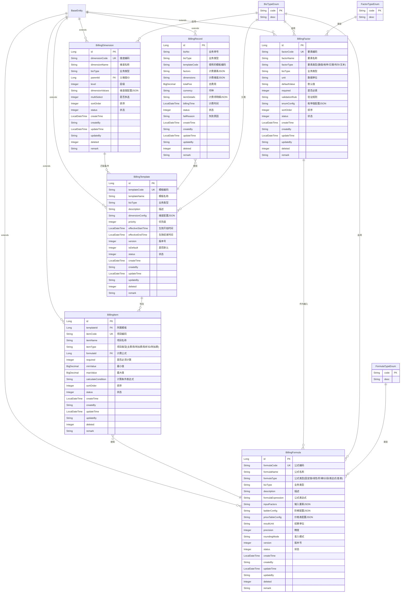

# 物流计费系统 - 领域模型关系图

## 领域模型概述

本系统是一个灵活的物流计费引擎，支持多种计费模式、阶梯计价、动态规则匹配等功能。

## 核心实体关系图



## 领域模型说明

### 核心概念

1. **BillingTemplate（计费模板）**
   - 定义特定业务场景下的计费规则集合
   - 通过维度配置支持条件匹配
   - 示例：标准物流计费模板、电商订单计费模板、冷链运输计费模板

2. **BillingItem（计费项目）**
   - 模板下的具体收费项
   - 每个项目关联一个计费公式
   - 支持计算条件控制是否计算
   - 示例：运费、保价费、包装费、仓储费

3. **BillingFormula（计费公式）**
   - 定义具体的计算逻辑
   - 支持多种计算模式：
     - 固定值
     - 线性计算（基础价格 + 单价 × 数量）
     - 阶梯计算（根据区间不同单价）
     - 分段计算（每个区间独立计算）
     - 表达式计算（MVEL表达式）
     - 查表计算（价格表查询）

4. **BillingFactor（计费要素）**
   - 参与计费的最小计算单元
   - 定义了各种维度的数据类型
   - 示例：重量、距离、体积、时效、地区

5. **BillingDimension（计费维度）**
   - 用于计费规则匹配的条件维度
   - 支持层级结构
   - 示例：地区、客户等级、商品类型、时段

6. **BillingRecord（计费记录）**
   - 记录每次计费的结果
   - 保存计费要素、维度、明细等信息
   - 用于审计和追溯

### 核心关系

```
BillingTemplate 1:N BillingItem
├─ BillingItem N:1 BillingFormula
│  └─ BillingFormula 使用 BillingFactor 作为输入
└─ BillingTemplate 通过 BillingDimension 进行匹配

计费流程：
业务单据 → 提取计费要素和维度
  → 匹配 BillingTemplate
  → 遍历 BillingItem
  → 使用 BillingFormula 计算
  → 生成 BillingRecord
```

## 枚举类型

### BizTypeEnum（业务类型）
- E_COMMERCE_ORDER（电商订单）
- LOGISTICS_WAYBILL（物流运单）
- WAREHOUSE_FEE（仓储费用）
- VALUE_ADDED_SERVICE（增值服务）

### FactorTypeEnum（要素类型）
- NUMERIC（数值型）
- ENUM（枚举型）
- DATE（日期型）
- BOOLEAN（布尔型）
- TEXT（文本型）

### FormulaTypeEnum（公式类型）
- FIXED（固定值）
- LINEAR（线性计算）
- LADDER（阶梯计算）
- SEGMENT（分段计算）
- EXPRESSION（表达式计算）
- TABLE_LOOKUP（查表计算）

## 领域模型特点

1. **高度可配置**：支持动态配置计费规则，无需修改代码
2. **灵活的计算模式**：支持多种计算方式，适应复杂计费场景
3. **维度匹配**：通过维度条件自动匹配最合适的计费模板
4. **版本管理**：模板和公式支持版本控制
5. **审计追溯**：完整记录计费过程和结果
6. **可扩展性**：通过业务类型和要素类型支持业务扩展

## 典型场景示例

### 场景1：标准物流运费计算
```
模板：标准物流运费模板
维度：{region: "华北地区", customerLevel: "普通"}
项目：
  - 基础运费（固定值：10元）
  - 重量运费（线性：单价 * 重量）
  - 距离运费（阶梯：按距离区间计算）
要素：{weight: 50kg, distance: 200km}
```

### 场景2：冷链运输计费
```
模板：冷链运输计费模板
维度：{productType: "冷链", temperature: "冷冻"}
项目：
  - 基础运费
  - 温控费用（根据温度等级）
  - 时效加急费
要素：{weight: 100kg, distance: 500km, temperature: "-18℃", urgency: "次日达"}
```
